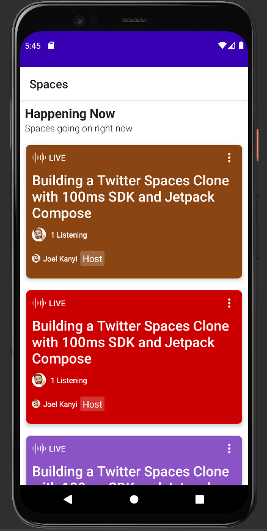
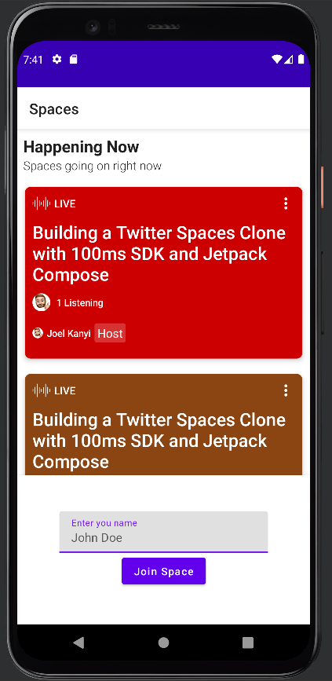
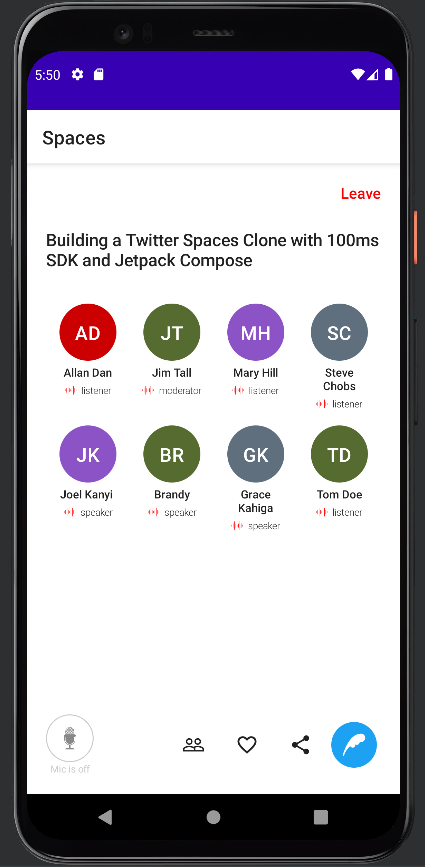

A simple Twitter spaces clone app with Jetpack compose to demonstrate the use of 100ms SDK in creating an Audio call feature in your apps.

[100ms](100ms.live/) offers a video conferencing infrastructure that provides web and mobile — native iOS and Android SDK, to add live video & audio conferencing to your applications.

You can read the clone's corresponding article that I wrote - [Building a Twitter Spaces clone for Android with 100ms SDK](https://www.100ms.live/blog/twitter-spaces-clone)

## Prerequisites

Add your Token endpoint in the `gradle.properties` file:

`TOKEN_ENDPOINT = "TOKEN_ENDPOINT_URL"`

## Screens
  

## Demo
https://user-images.githubusercontent.com/50293753/157378071-c1d6a16d-1eb5-4966-aeaf-3e209846355e.mp4
